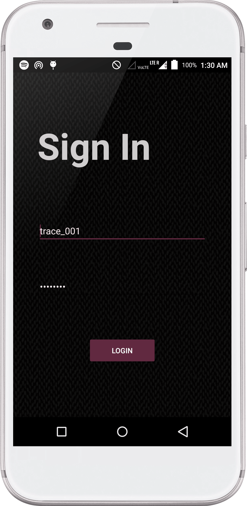
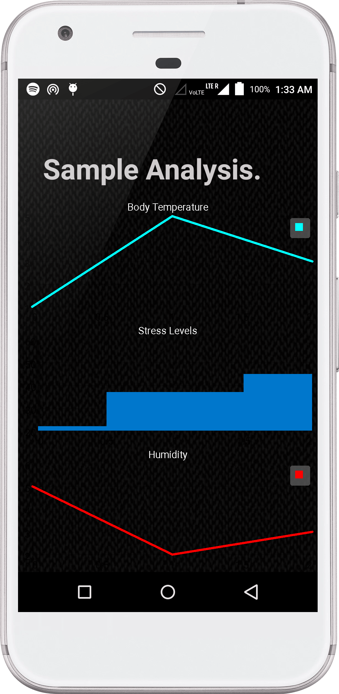

# Trace

</img>

There has been a soaring interest in smart companions at our homes. Devices like Alexa are being used in more and more households. In this project, we develop Trace - a companion designed to get parameters about the health of the user. Such parameters can be used for easier treatment when the user is ill or can also be used for early prediction of some kinds of diseases. 

# Timeline
This application was developed as part of the Reboot hackathon conducted by IEEE RAS society.

# Usage
1. The user signs into the application.
2. After successfull connection with the hardware, the user hits the '+' button to start receiving the parameters via Bluetooth.
3. On completion, the user clicks the name of the family member for whom the parameters were recorded.
4. The user can view different options on the homescreen to understand how the different parameters have been changing over time.

# Screenshots
</img> 
</img>
</img>

  </img> 
  </img>

